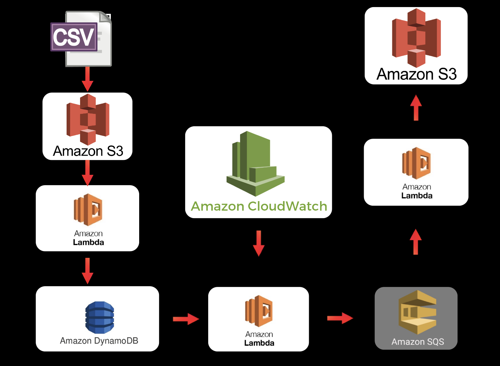

# Serverless-Data-Engineering-Pipeline
Serverless data engineering pipeline on AWS, using S3, DynamoDB, SQS and Lambda functions

## Architecture of the serverless Data Engineering Pipeline

## The architecture will work as follows: 

* We will start with a CVS file, which we will upload in a **S3 bucket**. The first **lambda function**, *s3_to_dynaomdb_lambda.py*  will get triggered when we make the upload. The function will read the csv file and write the data to a already created table in **DynamoDB**.

* Once the data is uploaded, we will move on to the next step. In the next step, we will use another **lambda function**, *dynamodb_to_sqs_lambda.py* to read the data from the table in **DynamoDB** and send it to **SQS**, which is a messaging service that stores messages/event for consumption by other aws services. This lambda will be triggered using **Cloudwatch events**, which will get triggered after certain interval (In this case 1 minute). 

